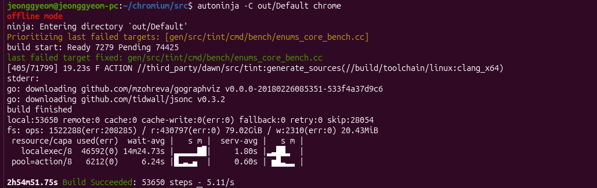

# Chromium Study Log - 2026-06-03

## 목표

Chromium 참여형 프로젝트 지원을 위해 개발 환경을 구축하고 Chromium 빌드 과정을 경험한다.

---

## 오늘 배운 Chromium 개발 흐름

```text
depot_tools
    ↓
fetch
    ↓
install-build-deps.sh
    ↓
gclient runhooks
    ↓
gn gen
    ↓
autoninja
```

## 빌드 완료 화면 캡처


## Chromium 개발 환경 구축

### depot_tools 설치

```bash
git clone https://chromium.googlesource.com/chromium/tools/depot_tools.git
```

### Chromium 소스 다운로드

```bash
fetch --nohooks --no-history chromium
```

### 빌드 의존성 설치

```bash
./build/install-build-deps.sh
```

### Hook 실행

```bash
gclient runhooks
```

### Chromium 빌드 시도 

```bash
autoninja -C out/Default chrome
```

### 결과

빌드가 정상적으로 시작되었으며 수만 개의 빌드 작업이 진행되었다.


### 빌드 실패 원인

```text
failed to initialize build cache at
/home/jeonggyeom/.cache/go-build

read-only file system
```

### 원인 분석

- Chromium 소스 문제는 아님
- Dawn/Tint 빌드 과정에서 Go Build Cache 생성 실패
- Codex Sandbox 환경의 파일 시스템 제약 가능성 확인

### 배운 점

대형 프로젝트의 빌드 과정에서는 코드뿐 아니라 캐시, 환경 변수, 빌드 시스템까지 이해해야 한다. 특히 코딩 에이전트 쓸 때 조심..